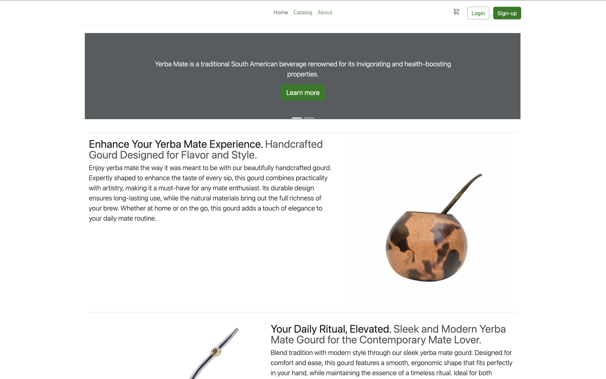
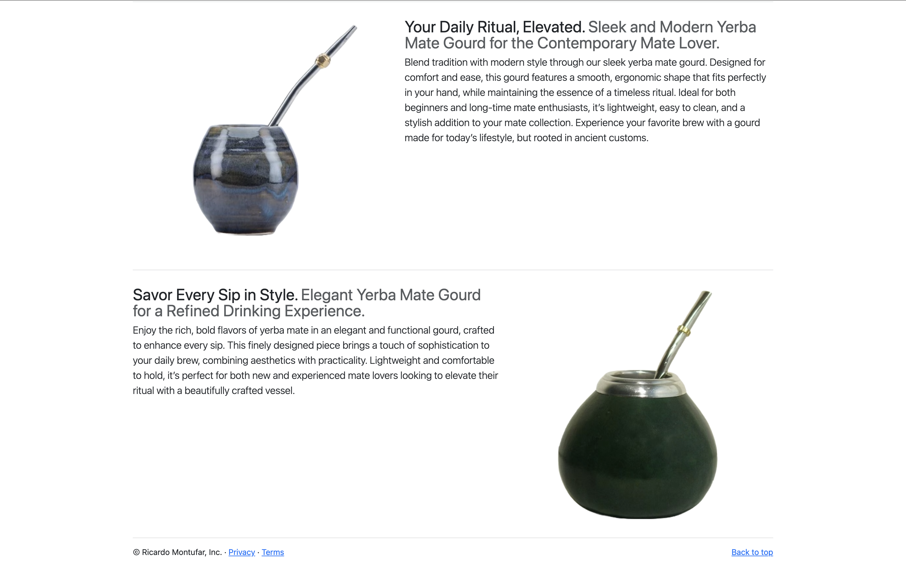
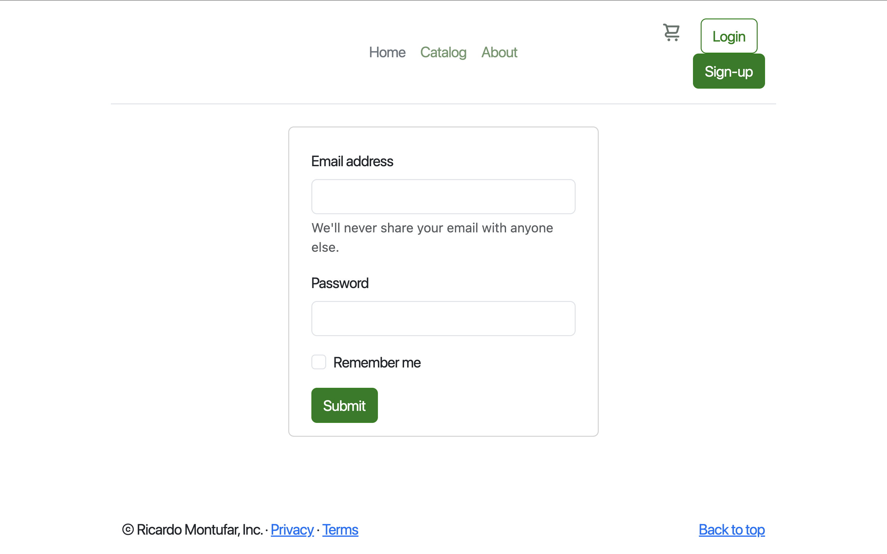
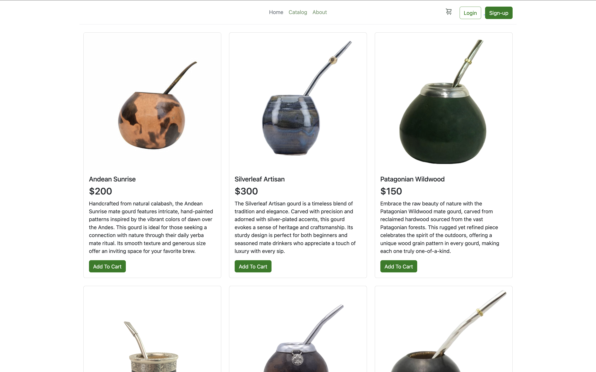
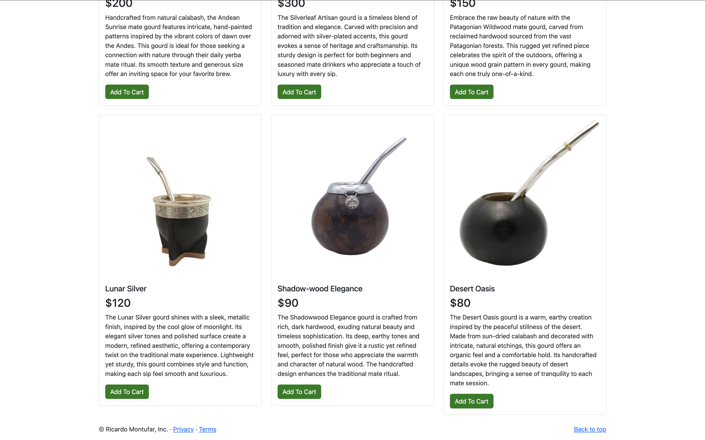
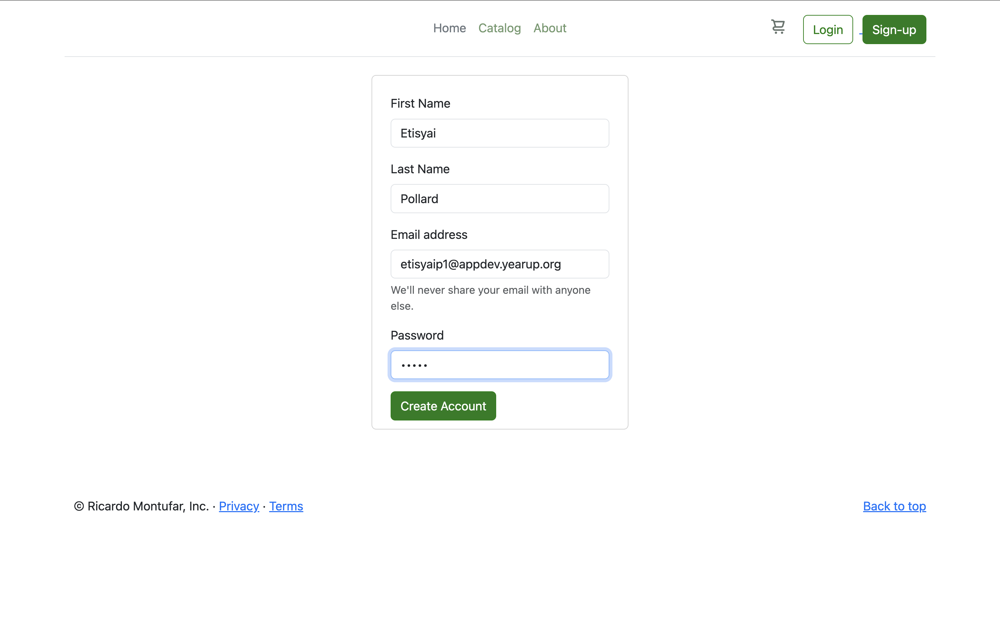
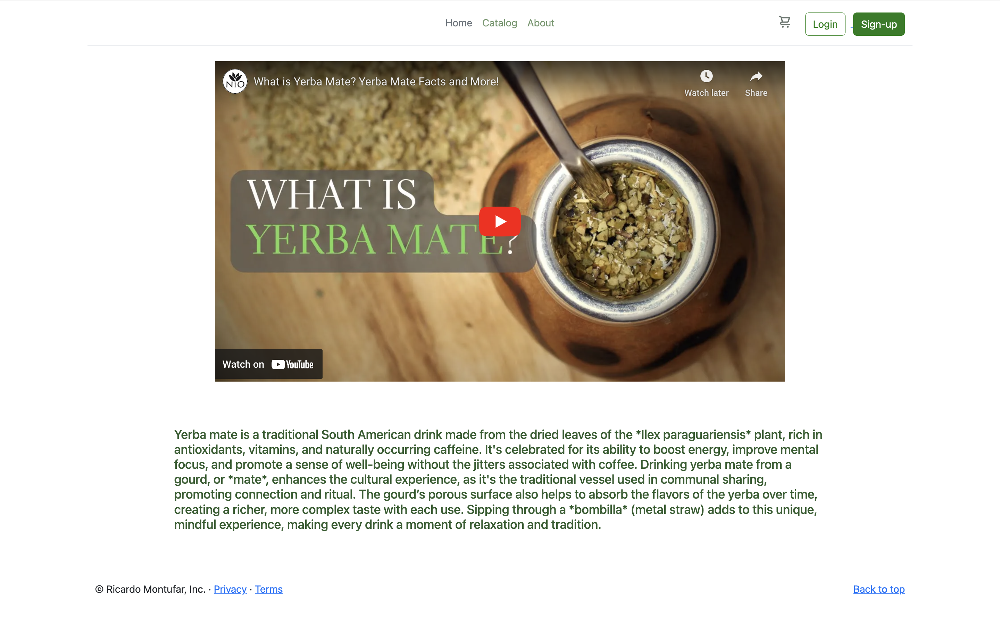
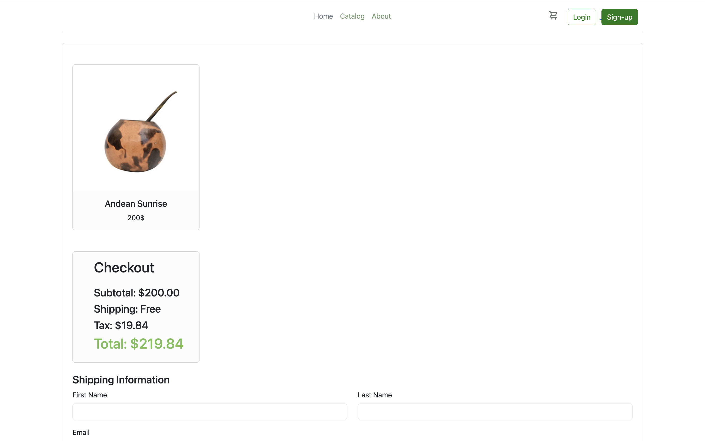
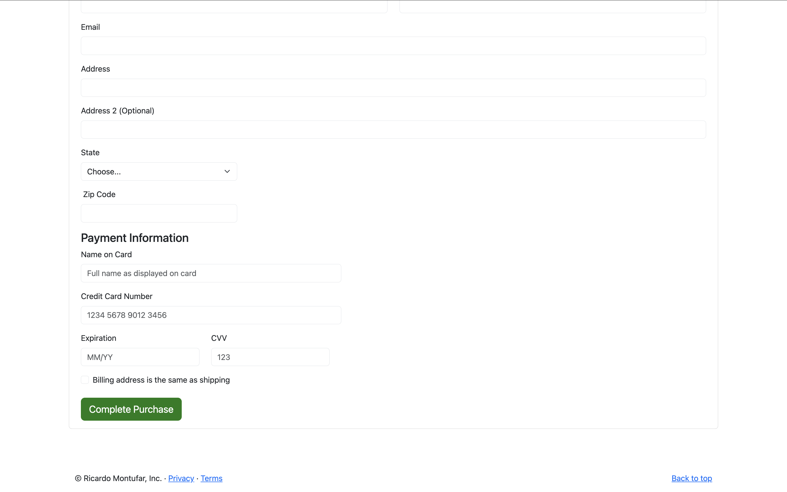

# "The Gourd Shoppe" 
- This project is a website designed for selling yerba mate gourds.

## Homepage 
- **Objective:** designed for educating on th ehistroy, orgin, and selling yerba mate gourds. 
- **Photos:** 1. homepage view
- **Navigation:** Home, Catalog, About, Login, Sign-Up
-**Carousel:** Learn more, Browse gourds
- **Footer:** Ricardo Montufar, Inc. Privacy, Terms, Back to top

## Login
- **Login Form:** Email address and password, remember me button, and submit button. 
- **Footer:** Ricardo Montufar, Inc. Privacy, Terms, Back to top

## Catalog 
- **Products:** Each gord, their price, and a description of each product. Add to Cart button.
- **Footer:** Ricardo Montufar, Inc. Privacy, Terms, Back to top

## Registration
- **Registration Form:** First name, Last name, Email, and Password. Create Account Button
- **Footer:** Ricardo Montufar, Inc. Privacy, Terms, Back to top

## About 
- **Quick Bio:** The history behind Yerba Mate and it's origins. 
- **Informational Video:** YouTube video introducing what Yerba Mate to audience. Video sourced directly from YouTube, not proprietary of my store.
- **Footer:** Ricardo Montufar, Inc. Privacy, Terms, Back to top

## Cart
- **Product:** Andean Sunrise,Price
- **Checkout Form:** Subtotal, Shipping, Tax, Total
- **Shipping Information:** First and Last name, Email, Address, State, and Zipcode
- **Payment Information:** Name on Card, CC Number, Expiration, CVV, Billing same as address box, Complete Purchase Button
- **Footer:** Ricardo Montufar, Inc. Privacy, Terms, Back to top

## Additonal Info
- ChatGPT was used for copywriting purposes, all text content was generated this way.
- All images are sourced from Google images, resized using squoosh app.

